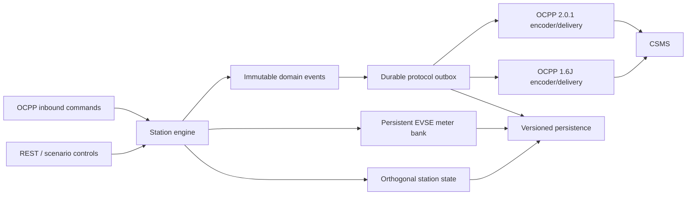

# Station Correctness Remediation Design

**Status:** Proposed implementation architecture for the July 2026 physical-correctness and OCPP behavior audit.

**Supersedes:** The April 2026 remediation series where current code or newly discovered cross-component behavior no longer matches those plans. The older plans remain useful history, but this design is the execution authority for the new remediation program.

## Goals

ChargeGhost should behave like a deterministic charging station whose OCPP traffic is a consequence of physical and transactional state. It must never accumulate energy without a connected EV and a closed power path, must preserve transaction chronology through disconnects and restarts, must enforce station and EVSE charging constraints, and must answer supported OCPP 1.6J and 2.0.1 requests with truthful state changes.

The program keeps the existing REST and WebSocket surfaces compatible unless a response currently describes impossible or unsupported behavior. Persisted state and queue files receive explicit schema versions and migrations. Existing OCPP identities, connector IDs, station IDs, and cumulative meter values must survive the migration.

## Non-goals

- Electrical transient or electromagnetic simulation.
- Full IEC 61851 or ISO 15118 wire-level emulation.
- Certification of every optional OCPP feature profile.
- Stochastic battery chemistry or thermal finite-element modeling.
- A single large rewrite that replaces the running engine before compatibility tests exist.

## Considered Approaches

### Patch defects in place

This minimizes early code movement, but it leaves ephemeral callbacks, protocol-owned transaction identity, and the overloaded `PersistentStatus` field intact. Several audit findings have the same architectural root, so local patches would create more conditional behavior and make restart recovery harder.

### Phased domain evolution — selected

This approach first blocks physically impossible behavior, then introduces immutable domain events and a durable protocol outbox. It gradually separates connector state axes, moves meter registers out of sessions, and gives each protocol adapter explicit recovery and configuration contracts. Compatibility adapters keep the current API stable while new persisted schemas are introduced.

### Ground-up station-model rewrite

This produces the cleanest code on paper, but it combines protocol, persistence, state-machine, and electrical changes into one cutover. The regression and data-migration risk is too high for a simulator with two OCPP versions and an existing fleet-management surface.

## Target Architecture



The engine remains the single source of truth. It emits immutable semantic events such as `SessionStarted`, `EnergyTransferChanged`, `SessionStopped`, `ReservationExpired`, and `FaultChanged` with the actual occurrence timestamp. Protocol adapters translate and persist those events before attempting network delivery. Closures in `CommandDispatcher` remain suitable for non-durable point-in-time work, but transaction lifecycle and billable meter events use the outbox exclusively.

## Orthogonal State Model

Connector status must be derived from independent facts rather than stored as one mutable status:

```go
type ConnectorRuntime struct {
    Operative     bool
    Cable         CableState
    Lock          LockState
    Contactor     ContactorState
    EVReady       bool
    EVSEReady     bool
    Fault         *Fault
    ReservationID *int
    SessionID     string
}
```

OCPP 1.6J `ChargePointStatus` and OCPP 2.0.1 `ConnectorStatus` become projections. Reservation expiry cannot make an inoperative connector operative; clearing a fault cannot erase a reservation; an open contactor cannot report non-zero imported current. Transitional compatibility fields may remain in snapshots for one schema version, but all mutations must target the independent facts.

## Transaction Identity and Durable Delivery

Every engine session receives a stable local UUID before the start event is emitted. OCPP 2.0.1 uses that UUID as `transactionId`. OCPP 1.6J stores a mapping from the local session UUID to the CSMS-assigned integer. Queued MeterValues and StopTransaction records reference the local UUID, not a provisional integer, so replay resolves the current mapping after StartTransaction succeeds.

The outbox stores typed, versioned records rather than Go closures or untyped interface payloads:

```go
type OutboxRecord struct {
    SchemaVersion int             `json:"schema_version"`
    ID            string          `json:"id"`
    StationID     string          `json:"station_id"`
    Protocol      string          `json:"protocol"`
    SessionID     string          `json:"session_id,omitempty"`
    SequenceNo    int             `json:"sequence_no,omitempty"`
    Kind          string          `json:"kind"`
    OccurredAt    time.Time       `json:"occurred_at"`
    Offline       bool            `json:"offline"`
    Payload       json.RawMessage `json:"payload"`
    Attempts      int             `json:"attempts"`
    NextAttemptAt time.Time       `json:"next_attempt_at,omitempty"`
}
```

Delivery acknowledges a record only after a valid protocol response. Transport errors retain it with retry metadata. For 1.6J, records for one transaction preserve Start → MeterValues → Stop ordering. For 2.0.1, stable sequence numbers preserve order and replayed records set `offline=true`. Point-in-time connector status is refreshed from the engine after registration rather than replaying stale states.

## Metering and Electrical Model

Meter registers belong to EVSEs and survive transactions. Session energy is `meterStop - meterStart`; the register is monotonic. The electrical supply explicitly records AC or DC and voltage interpretation:

```go
type ElectricalSupply struct {
    Kind             SupplyKind // AC or DC
    VoltageV         float64
    VoltageReference VoltageReference // LineToNeutral, LineToLine, DC
    RatedCurrentA    float64
    Phases           int
    PowerFactor      float64
    Efficiency       float64
}
```

One shared power function produces engine energy increments and OCPP power/current measurands. For balanced AC it uses either `phases * V_LN * I * PF` or `sqrt(3) * V_LL * I * PF`; DC uses `V * I`. Charging allocations include the effective phase count. Negative current, power, interval, energy delta, and SoC are rejected at boundaries.

## Smart-Charging Model

Profile parsing and validation are separate from allocation. A resolver evaluates validity, schedule duration, recurring windows, stack level, transaction scoping, requested unit, and phase count. A station allocator then combines EVSE limits with station-wide maximum and external constraints. The output is a physical allocation:

```go
type ChargingAllocation struct {
    CurrentA float64
    PowerW   float64
    Phases   int
    Sources  []LimitSource
}
```

The engine consumes allocations, not raw profile values. Composite schedules use the same resolver and allocator, including station-total requests and requested A/W units, preventing runtime behavior and reported schedules from diverging.

## Compatibility and Migration

`engine.json`, the transaction mapping, and the outbox receive independent schema versions. Loading is read-old/write-new. Migration tests use committed golden fixtures for current production-shaped files, including active sessions, reservations, faults, multi-EVSE meters, and pending remote starts.

The first release retains current REST field names and WebSocket event types. New physical detail is additive. Behavior that currently violates invariants—energy after unplug, sessions on inoperative connectors, negative energy, or false OCPP acceptance—is corrected without a compatibility flag. Higher-fidelity timing, battery curves, and configurable transaction start/stop points ship behind an explicit station-model version until scenario tests demonstrate compatibility.

## Error Handling

- Domain validation returns typed errors and never partially mutates state.
- Failed OCPP delivery retains durable records; malformed records move to dead-letter storage with diagnostics.
- Unsupported protocol commands return protocol-appropriate rejection or unsupported status.
- Invalid writable configuration values are rejected before persistence.
- Recovery reconciliation either reconstructs a valid active transaction or safely terminates it with a recorded reason; it never silently drops an active session.
- State projections assert invariants in tests and optionally in debug builds.

## Testing Strategy

Each wave follows red-green-refactor and ends with the full test and vet gates. New scenario tests drive one station through both adapters and compare physical state, protocol messages, timestamps, transaction identity, meter deltas, and restart behavior. Golden persistence tests verify every migration. Property tests cover energy monotonicity, non-negative allocations, state projection consistency, and aggregate station limits.

The final conformance matrix includes local and remote start, offline start/stop/replay, authorization rejection, EV disconnect with both stop settings, faults, resets, reservations, smart-charging transitions, multi-EVSE allocation, process restart, and configuration changes for both OCPP versions.
